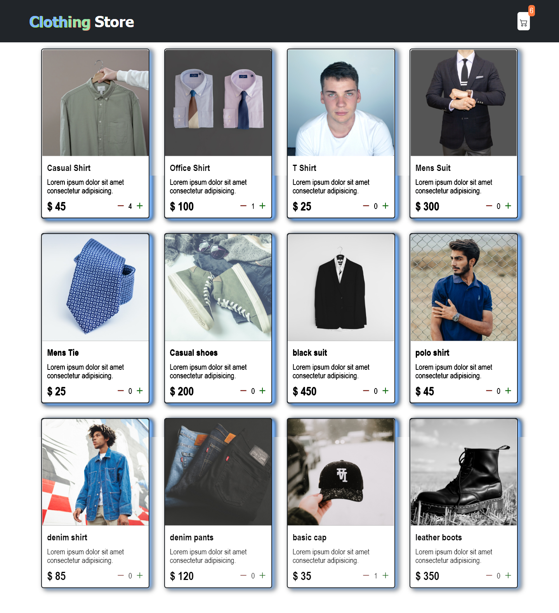

# Shopping cart

## Web preview

.png)

## Resources
Icons: [Boostrap-icons](icons.getboostrap.com)

Color palette: [Color Palettes](coolors.co/palettes/trending)

## Acknowledgement
### Project guided by the [Youtube](https://www.youtube.com/watch?v=cT_ZYrS3tKc) tutorial of the [Freecodecamp](https://www.freecodecamp.org/) platform.
### See profile:
